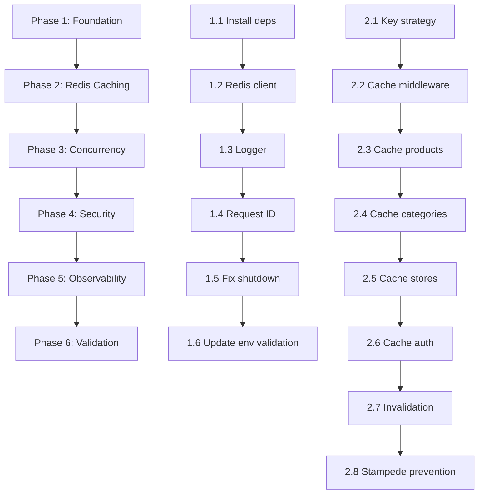

# Shopyos Backend — Audit & Optimization Task Plan

> **Generated:** 2026-02-26  
> **Scope:** Review, rebuild, and optimize the existing Node.js ecommerce backend  
> **Target:** 500+ concurrent users with Redis caching, proper concurrency, and hardened security  
> **Constraints:** No frontend changes. No new features — only improve what exists. Maintain all API contracts. Postgres (Postgres) + Object Storage remain. New migration files only (never alter existing migrations).

---

## Table of Contents

1. [Audit Summary](#1-audit-summary)
2. [Phase 1 — Foundation & Infrastructure](#2-phase-1--foundation--infrastructure)
3. [Phase 2 — Redis Caching Layer](#3-phase-2--redis-caching-layer)
4. [Phase 3 — Concurrency & Database Hardening](#4-phase-3--concurrency--database-hardening)
5. [Phase 4 — Security & Reliability](#5-phase-4--security--reliability)
6. [Phase 5 — Observability & Monitoring](#6-phase-5--observability--monitoring)
7. [Phase 6 — Final Validation & Load Testing](#7-phase-6--final-validation--load-testing)
8. [Database Migration Plan](#8-database-migration-plan)

---

## 1. Audit Summary

### 1.1 Architecture Overview

| Layer | Files | Technology |
|---|---|---|
| Entry point | `server.js` | Express 4.x |
| Config | `config/postgres.js`, `config/storage.js`, `config/production.js` | Postgres JS client, Object Storage SDK |
| Middleware | `authMiddleware.js`, `errorHandler.js`, `rateLimiter.js`, `upload.js` | JWT, express-rate-limit, multer |
| Controllers | 16 controllers | Direct repository calls |
| Data Access | 21 repositories (`db/repositories/`) | Postgres JS client (PostgREST) |
| Services | `notificationService.js` | Nodemailer, Arkesel SMS |
| Utils | `uploadHelpers.js`, `validateEnv.js` | Object Storage helpers |

### 1.2 Critical Issues Found

> [!CAUTION]
> These issues will cause failures at 500+ concurrent users.

| # | Issue | Severity | Location |
|---|---|---|---|
| C1 | **No Redis caching at all** — every request hits Postgres directly | 🔴 Critical | All controllers |
| C2 | **Order creation has no database transaction** — `createOrderWithItems()` uses sequential inserts without atomicity; overselling risk | 🔴 Critical | `OrderRepository.js:198-223` |
| C3 | **No inventory reservation/atomic decrement on order** — stock not decremented at order time, enabling overselling under concurrency | 🔴 Critical | `orderController.js:22-185` |
| C4 | **`withTransaction()` is a no-op** — returns the same Postgres client without actual BEGIN/COMMIT/ROLLBACK | 🔴 Critical | `config/postgres.js:105-114` |
| C5 | **Rate limiter uses in-memory store** — won't work across multiple server instances; resets on restart | 🟡 High | `middleware/rateLimiter.js` |
| C6 | **`unhandledRejection` calls `gracefulShutdown()`** — a single unhandled promise rejection terminates the entire server | 🟡 High | `server.js:261-264` |
| C7 | **Auth middleware queries DB on every request** — no caching of user data after JWT verification | 🟡 High | `authMiddleware.js:21` |
| C8 | **Role-check middleware queries DB redundantly** — `admin()`, `seller()`, `driver()`, `hasAnyRole()` each independently fetch user roles after `protect()` already did | 🟡 High | `authMiddleware.js:60-154` |
| C9 | **N+1 query in `getReviewableProducts()`** — iterates orders and calls `findProductReviewByUser()` per product inside a loop | 🟡 High | `ReviewRepository.js:415-453` |
| C10 | **`getCategories()` fetches ALL products to count by category** — unbounded query on products table just to build counts | 🟡 High | `productController.js:246-257` |
| C11 | **`getPlatformAnalytics()` loads ALL orders, ALL products, ALL reviews into memory** — will OOM at scale | 🟡 High | `AdminRepository.js:252-294` |
| C12 | **Duplicate bcrypt dependency** — both `bcrypt` and `bcryptjs` installed | 🟠 Medium | `package.json` |
| C13 | **Unnecessary Expo dependencies** in backend — `expo-auth-session`, `expo-random` | 🟠 Medium | `package.json` |
| C14 | **`resetPassword()` creates a new SMTP transporter on every call** instead of reusing | 🟠 Medium | `authController.js:119-125` |
| C15 | **`recordImpression()` / `recordClick()` have race conditions** — read-then-update without locking | 🟠 Medium | `PromotedProductRepository.js:178-246` |
| C16 | **`getOrCreateCart()` has TOCTOU race** — check-then-create without upsert | 🟠 Medium | `CartRepository.js:16-26` |
| C17 | **Missing input validation** on most controller endpoints (no express-validator usage despite being installed) | 🟠 Medium | All controllers |
| C18 | **`console.log` debug statements left in production code** | 🟢 Low | `productController.js:299,342` |
| C19 | **CORS set to `origin: '*'`** in production config | 🟢 Low | `config/production.js:25` |
| C20 | **No structured logging** — only `console.log`/`console.error` | 🟢 Low | All files |
| C21 | **No request ID tracing** for debugging concurrent requests | 🟢 Low | `server.js` |

---

## 2. Phase 1 — Foundation & Infrastructure ✅ COMPLETE

> **Goal:** Install dependencies, create the Redis client, set up structured logging, and fix foundational issues before layering on caching.
>
> **Status:** All tasks implemented. Server validated — starts successfully with all new modules.
> **Bonus:** Tasks 4.2 (Redis rate limiting), 4.3 (error handler), 4.4 (CORS fix), 4.5 (email transporter), 4.7 (debug logs) were also completed during this phase.

### Task 1.1 — Install Required Dependencies

**File:** `package.json`

```
npm install ioredis winston uuid rate-limit-redis cookie-parser
npm uninstall expo-auth-session expo-random bcrypt
```

| Package | Purpose |
|---|---|
| `ioredis` | Redis client with connection pooling, cluster support, pipelining |
| `winston` | Structured JSON logging with log levels |
| `uuid` | Request ID generation for tracing |
| `rate-limit-redis` | Redis-backed store for express-rate-limit |
| `cookie-parser` | Parse cookies for refresh token rotation |
| Remove `bcrypt` | Keep only `bcryptjs` (pure JS, no native build issues) |
| Remove `expo-*` | Frontend-only packages, should not be in backend |

### Task 1.2 — Create Redis Client Configuration

**New file:** `config/redis.js`

- Create a singleton `ioredis` client with connection reuse
- Support `REDIS_URL` env variable (for Render/Railway/Upstash)
- Configure connection pooling options (`maxRetriesPerRequest`, `enableReadyCheck`, `lazyConnect`)
- Implement `getRedis()` that returns the singleton
- Add graceful disconnect on `SIGTERM`/`SIGINT`
- Add health check method for `/health` endpoint
- Export cache helper functions: `cacheGet()`, `cacheSet()`, `cacheDel()`, `cacheDelPattern()`

### Task 1.3 — Create Structured Logger

**New file:** `config/logger.js`

- Use Winston with JSON format in production, colorized in development
- Log levels: `error`, `warn`, `info`, `http`, `debug`
- Include timestamp, request ID, file context in each log line
- Replace all `console.log`/`console.error` across the codebase with logger calls
- Add Morgan-style HTTP request logging middleware

### Task 1.4 — Add Request ID Middleware

**Modified file:** `server.js`

- Add middleware that generates a UUID `requestId` for every request
- Attach to `req.requestId` and set `X-Request-ID` response header
- Pass to logger context for all downstream log calls

### Task 1.5 — Fix Graceful Shutdown

**Modified file:** `server.js`

- Change `unhandledRejection` handler to **log and continue** instead of shutting down
- Only `uncaughtException` should trigger shutdown
- Add Redis disconnect to `gracefulShutdown()`
- Add drain timeout for in-flight requests

### Task 1.6 — Update Environment Validation

**Modified file:** `utils/validateEnv.js`

- Add `REDIS_URL` to required (or optional with warning) variables
- Add `LOG_LEVEL` as optional

---

## 2.5 Phase 1.5 — Production-Grade Authentication ✅ COMPLETE

> **Goal:** Implement industry-standard auth with short-lived access tokens, secure refresh token rotation, token blacklisting, and session management.
>
> **Status:** All tasks implemented. New migration, config, controller, middleware, and routes created.

### Previous Issues

| Problem | Impact |
|---|---|
| Access tokens lived 7-30 days | Stolen token = full account compromise for weeks |
| No refresh tokens | No way to keep sessions alive without long-lived access tokens |
| Logout only cleared cookie | Token still valid for Bearer auth (mobile) — no server-side invalidation |
| No token rotation | Stolen refresh token could be reused indefinitely |
| Roles queried 3-4x per request | Each role middleware independently hit DB |

### Implemented Solution

#### Token Architecture

```
┌──────────────────────────────────────────────────────┐
│                  CLIENT (Mobile / Web)                │
│                                                      │
│  Access Token (JWT, 15 min)  ←→  Bearer header       │
│  Refresh Token (opaque, 7 days)  ←→  body / cookie   │
└──────────────────────────────────────────────────────┘
         │                       │
         ▼                       ▼
┌────────────────┐     ┌─────────────────┐
│  Auth Middleware │     │  /auth/refresh   │
│  - Verify JWT   │     │  - Hash token    │
│  - Check blacklist│   │  - Find in DB    │
│  - Load user+roles│   │  - Reuse detect  │
│  - Cache in Redis │   │  - Rotate token  │
└────────────────┘     │  - Issue new pair │
                       └─────────────────┘
```

#### New Files

| File | Purpose |
|---|---|
| `config/auth.js` | Centralized auth constants (token TTLs, cookie config, hash functions) |
| `migrations/013_refresh_tokens.sql` | `refresh_tokens` table with SHA-256 hashed storage, family tracking, cascading revocation |

#### Modified Files

| File | Changes |
|---|---|
| `controllers/authController.js` | Complete rewrite: 15-min access tokens, 7-day refresh tokens, rotation, blacklisting, session management |
| `middleware/authMiddleware.js` | Token blacklist check, `TOKEN_EXPIRED` code for frontend, `optionalAuth` middleware |
| `routes/authRoutes.js` | Added `/refresh`, `/logout-all`, `/sessions`, `/sessions/:sessionId` |
| `server.js` | Added `cookie-parser` middleware |
| `package.json` | Added `cookie-parser` dependency |

#### New API Endpoints

| Method | Path | Auth | Description |
|---|---|---|---|
| `POST` | `/api/v1/auth/refresh` | Public | Exchange refresh token for new token pair |
| `POST` | `/api/v1/auth/logout-all` | Private | Revoke all sessions for the user |
| `GET` | `/api/v1/auth/sessions` | Private | List active sessions (device, IP, time) |
| `DELETE` | `/api/v1/auth/sessions/:id` | Private | Revoke a specific session |

#### Security Features

1. **Short-lived access tokens (15 min)** — Limits exposure window
2. **SHA-256 hashed refresh tokens** — Raw tokens NEVER stored in DB
3. **Token family rotation detection** — If a revoked refresh token is reused, ALL tokens in that family are invalidated (stolen token detection)
4. **Redis blacklisting of access tokens** — On logout, the access token is stored in Redis with TTL matching its remaining lifetime
5. **Session management** — Users can view and revoke individual sessions
6. **`TOKEN_EXPIRED` error code** — Frontend can auto-trigger `/refresh` flow
7. **Device/IP tracking** — Each refresh token records user agent and IP

---

## 2.6 Phase 1.6 — Development Cleanup

> **Goal:** Isolate development-only code so it does NOT execute in production.

### Task 1.6.1 — Isolate Dev-Only Code

The following items are already environment-aware and correctly gated:

| Item | Status | Mechanism |
|---|---|---|
| Stack traces in error responses | ✅ Gated | `errorHandler.js` only includes `stack` when `NODE_ENV === 'development'` |
| Logger format | ✅ Gated | `logger.js` uses colorized output in dev, JSON in production |
| Cookie `secure` flag | ✅ Gated | `config/auth.js` sets `secure: false` only in development |
| CORS `origin: '*'` | ✅ Warned | Falls back to `'*'` only if `CORS_ORIGINS` env var not set |

### Task 1.6.2 — Remove/Guard Remaining Dev Items

| Item | Location | Action |
|---|---|---|
| `verifyPayment` (payment simulation) | `orderController.js:528-589` | Guard with `NODE_ENV !== 'production'` check — return 404 in production |
| Remaining `console.log` / `console.error` in controllers | Multiple controllers | Replace with `logger` calls (batch update) |
| `JWT_EXPIRE` env variable | `.env` | No longer used — access token expiry is hardcoded to 15 min in `config/auth.js` |
| `nodemon` in production dependencies | `package.json` | Move to `devDependencies` |

### Task 1.6.3 — Production Security Checklist

| Env Variable | Required in Production | Purpose |
|---|---|---|
| `JWT_SECRET` | ✅ Yes (≥32 chars) | Access token signing |
| `REDIS_URL` | ✅ Yes | Cache, rate limiting, token blacklist |
| `CORS_ORIGINS` | ✅ Yes | Restrict allowed origins |
| `NODE_ENV` | ✅ Must be `production` | Guards dev-only features |

---

## 3. Phase 2 — Redis Caching Layer

> **Goal:** Implement Redis caching for all read-heavy endpoints with proper key strategy, TTL policies, and invalidation.

### Task 2.1 — Cache Key Strategy

Design a consistent, hierarchical key scheme:

```
shopyos:{entity}:{identifier}:{variant}
```

| Key Pattern | TTL | Example |
|---|---|---|
| `shopyos:products:search:{hash}` | 5 min | Product search results (hash of query/filters/sort/pagination) |
| `shopyos:products:detail:{productId}` | 10 min | Single product with full details |
| `shopyos:products:store:{storeId}:{page}:{limit}` | 5 min | Store product listing |
| `shopyos:products:promoted` | 5 min | Promoted products |
| `shopyos:categories:all` | 30 min | All categories with counts |
| `shopyos:categories:counts` | 10 min | Category product counts |
| `shopyos:stores:detail:{storeId}` | 10 min | Store details |
| `shopyos:stores:featured` | 10 min | Featured stores |
| `shopyos:users:{userId}:roles` | 5 min | User roles (used by auth middleware) |
| `shopyos:users:{userId}:profile` | 5 min | User profile data |
| `shopyos:reviews:product:{productId}:{page}` | 5 min | Product reviews |
| `shopyos:reviews:store:{storeId}:{page}` | 5 min | Store reviews |

For search/listing keys with complex params, hash the sorted query params with a lightweight hash (e.g., `crypto.createHash('md5').update(JSON.stringify(sortedParams)).digest('hex')`).

### Task 2.2 — Create Cache Middleware / Helpers

**New file:** `middleware/cache.js`

- `cacheMiddleware(keyGenerator, ttlSeconds)` — Express middleware that checks Redis first; if hit, returns cached JSON; if miss, patches `res.json()` to intercept and cache the response
- `generateCacheKey(req, prefix)` — Builds deterministic cache key from request params, query, sorted
- Cache stampede prevention: use Redis `SET NX EX` (setnx with TTL) as a lock mechanism. When cache misses, only one request fetches from DB; others wait and retry reading from cache

### Task 2.3 — Cache Product Endpoints

**Modified files:** `controllers/productController.js`, `ProductRepository.js`

| Endpoint | Method | Cache Key | TTL |
|---|---|---|---|
| `GET /products/search` | `searchProducts` | `shopyos:products:search:{hash}` | 5 min |
| `GET /products/:id` | `getProductById` | `shopyos:products:detail:{id}` | 10 min |
| `GET /products/store/:storeId` | `getStoreProducts` | `shopyos:products:store:{storeId}:{page}` | 5 min |
| `GET /products/categories` | `getCategories` | `shopyos:categories:all` | 30 min |

### Task 2.4 — Cache Category Endpoints

**Modified files:** `controllers/categoryController.js`

| Endpoint | Cache Key | TTL |
|---|---|---|
| `GET /categories` | `shopyos:categories:all` | 30 min |

### Task 2.5 — Cache Store/Business Endpoints

**Modified files:** `controllers/businessController.js`

| Endpoint | Cache Key | TTL |
|---|---|---|
| `GET /business/all` | `shopyos:stores:all:{hash}` | 5 min |
| `GET /business/:id` | `shopyos:stores:detail:{id}` | 10 min |

### Task 2.6 — Cache Auth Middleware User/Role Lookups

**Modified file:** `middleware/authMiddleware.js`

- After JWT decode, check Redis for `shopyos:users:{userId}:data` before DB query
- After role checks, cache role result in `shopyos:users:{userId}:roles`
- Set short TTL (5 min) so role changes propagate quickly

### Task 2.7 — Implement Cache Invalidation

**New file:** `config/cacheInvalidation.js`

Create invalidation functions called from write operations:

| Trigger Event | Keys to Invalidate |
|---|---|
| Product created/updated/deleted | `shopyos:products:detail:{id}`, `shopyos:products:store:{storeId}:*`, `shopyos:products:search:*`, `shopyos:categories:*` |
| Inventory/stock changed | `shopyos:products:detail:{id}`, `shopyos:products:store:{storeId}:*` |
| Order created | `shopyos:products:detail:{productId}` (for each item — stock/sales count changed) |
| Category created/updated/deleted | `shopyos:categories:*` |
| Store updated | `shopyos:stores:detail:{id}`, `shopyos:stores:all:*`, `shopyos:stores:featured` |
| User role changed | `shopyos:users:{userId}:roles`, `shopyos:users:{userId}:data` |
| Review created/updated | `shopyos:reviews:product:{productId}:*`, `shopyos:reviews:store:{storeId}:*`, `shopyos:products:detail:{productId}` |
| User profile updated | `shopyos:users:{userId}:profile`, `shopyos:users:{userId}:data` |

Use `SCAN` with pattern matching for wildcard invalidation (not `KEYS`).

### Task 2.8 — Cache Stampede Prevention

**Implemented in:** `middleware/cache.js`

- On cache miss, acquire a short-lived Redis lock (`SET shopyos:lock:{key} 1 NX EX 10`)
- If lock acquired: fetch from DB, write to cache, release lock
- If lock NOT acquired: wait 50ms, retry reading from cache (up to 3 retries)
- After retries, fall through to DB query (graceful degradation)

---

## 4. Phase 3 — Concurrency & Database Hardening

> **Goal:** Fix race conditions, implement proper transactions, prevent overselling, and optimize queries.

### Task 3.1 — Implement Atomic Order Creation with Postgres RPC

**New migration file:** `migrations/013_atomic_order_creation.sql`

Create a Postgres function `create_order_atomic()` that:

1. Begins a transaction
2. For each order item: decrements `inventory.quantity` with `WHERE quantity >= requested_quantity` (atomic check-and-decrement)
3. If any item fails the stock check, rolls back the entire transaction
4. Inserts the order record
5. Inserts all order items
6. Inserts the payment record
7. Returns the created order with items

**Modified files:** `OrderRepository.js`, `orderController.js`

- Replace `createOrderWithItems()` with a call to the new RPC function
- Remove the sequential insert pattern
- Handle the "insufficient stock" error from the RPC gracefully

### Task 3.2 — Fix Cart Race Condition (getOrCreateCart)

**Modified file:** `CartRepository.js`

- Replace check-then-create with Postgres `upsert`:
  ```javascript
  // Use ON CONFLICT (user_id) DO NOTHING + select
  const { data } = await this.db
    .from('carts')
    .upsert({ user_id: userId }, { onConflict: 'user_id', ignoreDuplicates: true })
    .select()
    .single();
  ```
- Same pattern for `addItem()` — the existing upsert-like logic should use DB-level `ON CONFLICT`

### Task 3.3 — Fix Promoted Product Race Conditions

**Modified file:** `PromotedProductRepository.js`

- Replace `recordImpression()` and `recordClick()` read-then-write with atomic `UPDATE SET impressions = impressions + 1` using RPC

**New migration file:** `migrations/014_atomic_promotion_counters.sql`

- Create RPC functions `record_promotion_impression(campaign_id UUID)` and `record_promotion_click(campaign_id UUID)` that atomically increment and check budget

### Task 3.4 — Fix N+1 Query in ReviewRepository

**Modified file:** `ReviewRepository.js`

- Rewrite `getReviewableProducts()` to use a single query with LEFT JOIN against `product_reviews`:
  ```sql
  SELECT oi.product_id, oi.product_title, p.*
  FROM orders o
  JOIN order_items oi ON oi.order_id = o.id
  JOIN products p ON p.id = oi.product_id
  LEFT JOIN product_reviews pr ON pr.product_id = oi.product_id AND pr.buyer_id = $1
  WHERE o.buyer_id = $1 AND o.status = 'completed' AND pr.id IS NULL
  ```
- Or use Postgres client with a single joined query and client-side filtering

### Task 3.5 — Fix Category Product Count Query

**Modified file:** `productController.js` → `getCategories()`

- Replace fetching ALL products with a `GROUP BY category` count query:
  ```javascript
  const { data } = await repositories.products.db
    .rpc('get_category_counts'); // New RPC function
  ```
- Or use Postgres's `.select('category', { count: 'exact' })` with grouping

**New migration file:** `migrations/015_category_count_rpc.sql`

- Create `get_category_counts()` function that returns `category, count` using `GROUP BY`

### Task 3.6 — Fix Admin Analytics Queries

**Modified file:** `AdminRepository.js`

- Replace `getPlatformAnalytics()` with DB-level aggregations using RPC functions
- Avoid loading all records into JS memory

**New migration file:** `migrations/016_admin_analytics_rpcs.sql`

- `get_order_stats()` — returns total, completed, pending, cancelled counts and revenue sum
- `get_product_stats()` — returns total, active, out-of-stock counts
- `get_review_stats()` — returns total count and avg rating

### Task 3.7 — Add Missing Database Indexes

**New migration file:** `migrations/017_performance_indexes.sql`

```sql
-- Product search performance
CREATE INDEX IF NOT EXISTS idx_products_category_active ON products(category, is_active) WHERE deleted_at IS NULL;
CREATE INDEX IF NOT EXISTS idx_products_store_active ON products(store_id, is_active) WHERE deleted_at IS NULL;
CREATE INDEX IF NOT EXISTS idx_products_price ON products(price) WHERE is_active = true AND deleted_at IS NULL;
CREATE INDEX IF NOT EXISTS idx_products_created_at ON products(created_at DESC) WHERE is_active = true AND deleted_at IS NULL;

-- Order performance
CREATE INDEX IF NOT EXISTS idx_orders_buyer ON orders(buyer_id, created_at DESC);
CREATE INDEX IF NOT EXISTS idx_orders_store_status ON orders(store_id, status);
CREATE INDEX IF NOT EXISTS idx_order_items_order ON order_items(order_id);
CREATE INDEX IF NOT EXISTS idx_order_items_product ON order_items(product_id);

-- Cart performance
CREATE INDEX IF NOT EXISTS idx_carts_user ON carts(user_id);
CREATE INDEX IF NOT EXISTS idx_cart_items_cart ON cart_items(cart_id);
CREATE INDEX IF NOT EXISTS idx_cart_items_product ON cart_items(cart_id, product_id);

-- Inventory
CREATE INDEX IF NOT EXISTS idx_inventory_product ON inventory(product_id);

-- Reviews
CREATE INDEX IF NOT EXISTS idx_product_reviews_product ON product_reviews(product_id) WHERE deleted_at IS NULL;
CREATE INDEX IF NOT EXISTS idx_store_reviews_store ON store_reviews(store_id) WHERE deleted_at IS NULL;
CREATE INDEX IF NOT EXISTS idx_product_reviews_buyer ON product_reviews(buyer_id, product_id) WHERE deleted_at IS NULL;

-- Notifications
CREATE INDEX IF NOT EXISTS idx_notifications_user_unread ON notifications(user_id, is_read) WHERE is_read = false;

-- Favorites
CREATE INDEX IF NOT EXISTS idx_favorites_user ON favorites(user_id);
CREATE INDEX IF NOT EXISTS idx_favorites_user_product ON favorites(user_id, product_id);

-- Deliveries
CREATE INDEX IF NOT EXISTS idx_deliveries_driver ON deliveries(driver_id, status);
CREATE INDEX IF NOT EXISTS idx_deliveries_order ON deliveries(order_id);

-- Messages
CREATE INDEX IF NOT EXISTS idx_messages_conversation ON messages(conversation_id, created_at DESC);

-- Stores
CREATE INDEX IF NOT EXISTS idx_stores_owner ON stores(owner_id, is_active);

-- Payments
CREATE INDEX IF NOT EXISTS idx_payments_order ON payments(order_id);
```

---

## 5. Phase 4 — Security & Reliability

> **Goal:** Harden the backend against common security issues and improve reliability.

### Task 4.1 — Add Input Validation with express-validator

**New file:** `middleware/validators.js`

Create validation chains for all major endpoints:

- `validateRegister` — email format, password length (≥8), name required
- `validateLogin` — email required, password required
- `validateCreateProduct` — storeId UUID, name string 1-200 chars, price positive number
- `validateCreateOrder` — deliveryAddress, deliveryCity, deliveryPhone required, phone format
- `validateSearch` — limit integer 1-100, offset integer ≥0, minPrice/maxPrice positive
- `validateAddToCart` — productId UUID, quantity positive integer

**Modified files:** All route files to apply validation middleware before controller

### Task 4.2 — Improve Rate Limiting with Redis Store

**Modified file:** `middleware/rateLimiter.js`

- Install and use `rate-limit-redis` to back express-rate-limit with Redis
- This ensures rate limiting works across multiple server instances
- Adjust limits for 500 concurrent users:

| Endpoint | Current | Recommended |
|---|---|---|
| General API | 100/15min | 300/15min |
| Auth | 5/15min | 10/15min |
| Upload | 20/hr | 30/hr |
| Order | 10/hr | 20/hr |
| Message | 50/15min | 100/15min |

### Task 4.3 — Improve Error Handler

**Modified file:** `middleware/errorHandler.js`

- Add handling for Redis errors (connection refused, timeout)
- Add handling for Postgres-specific error codes (rate limit, connection pool exhausted)
- Add request ID in error responses for debugging
- Log structured error objects with Winston

### Task 4.4 — Fix CORS Configuration

**Modified file:** `config/production.js`

- Replace `origin: '*'` with a proper allowlist using `CORS_ORIGINS` env variable:
  ```javascript
  cors: {
    origin: process.env.CORS_ORIGINS
      ? process.env.CORS_ORIGINS.split(',')
      : '*',
    credentials: true,
    // ...
  }
  ```

### Task 4.5 — Fix Email Transporter Reuse

**Modified file:** `controllers/authController.js`

- Move the `nodemailer.createTransport()` call out of `resetPassword()` into a shared singleton (use the one from `NotificationService` or create one in config)
- This prevents creating a new SMTP connection on every password reset request

### Task 4.6 — Add Request Timeout Hardening

**Modified file:** `server.js`

- Add per-route timeout overrides for long operations (file uploads: 60s, general: 30s)
- Add `req.socket.setTimeout()` for proper TCP-level timeout
- Add AbortController pattern for Postgres queries to cancel on timeout

### Task 4.7 — Remove Debug Console Logs

**Modified files:** `productController.js`, any other controllers with debug `console.log`

- Remove `console.log` statements at lines 299, 342 in productController.js
- Replace remaining `console.log`/`console.error` with Winston logger calls

---

## 6. Phase 5 — Observability & Monitoring

> **Goal:** Add monitoring capabilities to detect and debug issues in production.

### Task 5.1 — Enhanced Health Check

**Modified file:** `server.js`

Expand `/health` endpoint to include:

```javascript
{
  success: true,
  status: 'healthy',
  timestamp: '...',
  uptime: process.uptime(),
  environment: '...',
  checks: {
    redis: { status: 'connected', latency: '2ms' },
    Postgres: { status: 'connected', latency: '15ms' },
    memory: {
      heapUsed: '45MB',
      heapTotal: '80MB',
      rss: '120MB'
    }
  }
}
```

### Task 5.2 — Add Performance Monitoring Middleware

**New file:** `middleware/performanceMonitor.js`

- Log slow queries (>1s response time) with full request context
- Track response time distribution
- Log memory usage warnings when heap exceeds threshold
- Track concurrent connection count

### Task 5.3 — Add Cache Hit/Miss Metrics

**Modified file:** `middleware/cache.js`

- Track and log cache hit rate, miss rate, and eviction count
- Expose via `/health` or separate `/metrics` endpoint

---

## 7. Phase 6 — Final Validation & Load Testing

> **Goal:** Verify all changes work correctly and the system handles 500+ concurrent users.

### Task 6.1 — API Contract Verification

- Test every endpoint to ensure response shapes haven't changed
- Verify backward-compatible field mapping (`_id`, `businessId`, `name`, etc.)
- Test legacy route redirects still work

### Task 6.2 — Cache Behavior Verification

- Test cache populate on first request
- Test cache hit on second request
- Test cache invalidation on write operations
- Test cache stampede prevention under concurrent requests
- Verify TTL expiration behavior

### Task 6.3 — Concurrency Testing

- Test concurrent order creation for same product (verify no overselling)
- Test concurrent cart additions
- Test concurrent promotion impressions/clicks
- Verify atomic operations work under load

### Task 6.4 — Load Test Script

**New file:** `scripts/load-test.js`

Create a script using `autocannon` or `k6` that:

- Simulates 500 concurrent users
- Mix of read (80%) and write (20%) operations
- Measures p50, p95, p99 response times
- Verifies no 500 errors under load
- Tests cache effectiveness (response time improvement)

---

## 8. Database Migration Plan

> [!IMPORTANT]
> All migration files go into `backend/migrations/`. You must manually review and apply them to Postgres.

### New Migration Files to Create

| File | Purpose |
|---|---|
| `013_atomic_order_creation.sql` | Postgres function for transactional order creation with atomic inventory decrement |
| `014_atomic_promotion_counters.sql` | RPC functions for atomic impression/click recording |
| `015_category_count_rpc.sql` | RPC function for efficient category counting |
| `016_admin_analytics_rpcs.sql` | RPC functions for aggregated admin dashboard stats |
| `017_performance_indexes.sql` | All performance indexes listed in Task 3.7 |

### Migration 013 — Atomic Order Creation (Pseudo-SQL)

```sql
CREATE OR REPLACE FUNCTION create_order_atomic(
  p_order_number TEXT,
  p_buyer_id UUID,
  p_store_id UUID,
  p_subtotal NUMERIC,
  p_tax NUMERIC,
  p_delivery_fee NUMERIC,
  p_total_amount NUMERIC,
  p_delivery_address TEXT,
  p_delivery_city TEXT,
  p_delivery_country TEXT DEFAULT 'Ghana',
  p_delivery_phone TEXT DEFAULT NULL,
  p_delivery_notes TEXT DEFAULT NULL,
  p_payment_method TEXT DEFAULT 'card',
  p_items JSONB -- Array of {product_id, product_title, quantity, price, subtotal}
) RETURNS JSONB AS $$
DECLARE
  v_order_id UUID;
  v_item JSONB;
  v_available INT;
BEGIN
  -- Check and decrement inventory for each item
  FOR v_item IN SELECT * FROM jsonb_array_elements(p_items)
  LOOP
    UPDATE inventory
    SET quantity = quantity - (v_item->>'quantity')::INT,
        updated_at = NOW()
    WHERE product_id = (v_item->>'product_id')::UUID
      AND quantity >= (v_item->>'quantity')::INT;

    IF NOT FOUND THEN
      -- Get current stock for error message
      SELECT quantity INTO v_available FROM inventory
      WHERE product_id = (v_item->>'product_id')::UUID;

      RAISE EXCEPTION 'Insufficient stock for product %: requested %, available %',
        v_item->>'product_title',
        v_item->>'quantity',
        COALESCE(v_available, 0);
    END IF;
  END LOOP;

  -- Insert order
  INSERT INTO orders (
    order_number, buyer_id, store_id, status,
    subtotal, tax, delivery_fee, total_amount,
    delivery_address_line1, delivery_city, delivery_country,
    delivery_phone, delivery_notes
  ) VALUES (
    p_order_number, p_buyer_id, p_store_id, 'pending',
    p_subtotal, p_tax, p_delivery_fee, p_total_amount,
    p_delivery_address, p_delivery_city, p_delivery_country,
    p_delivery_phone, p_delivery_notes
  ) RETURNING id INTO v_order_id;

  -- Insert order items
  INSERT INTO order_items (order_id, product_id, product_title, quantity, price, subtotal)
  SELECT
    v_order_id,
    (item->>'product_id')::UUID,
    item->>'product_title',
    (item->>'quantity')::INT,
    (item->>'price')::NUMERIC,
    (item->>'subtotal')::NUMERIC
  FROM jsonb_array_elements(p_items) AS item;

  -- Insert payment record
  INSERT INTO payments (order_id, payment_method, amount, status)
  VALUES (v_order_id, p_payment_method, p_total_amount, 'pending');

  -- Return the created order
  RETURN jsonb_build_object(
    'id', v_order_id,
    'order_number', p_order_number,
    'status', 'pending',
    'total_amount', p_total_amount
  );
END;
$$ LANGUAGE plpgsql;
```

---

## Execution Order

> [!TIP]
> Follow this exact order to minimize risk. Each phase builds on the previous one.



---

## File Change Summary

| Action | File | Phase |
|---|---|---|
| **New** | `config/redis.js` | 1 |
| **New** | `config/logger.js` | 1 |
| **New** | `config/cacheInvalidation.js` | 2 |
| **New** | `middleware/cache.js` | 2 |
| **New** | `middleware/validators.js` | 4 |
| **New** | `middleware/performanceMonitor.js` | 5 |
| **New** | `migrations/013_atomic_order_creation.sql` | 3 |
| **New** | `migrations/014_atomic_promotion_counters.sql` | 3 |
| **New** | `migrations/015_category_count_rpc.sql` | 3 |
| **New** | `migrations/016_admin_analytics_rpcs.sql` | 3 |
| **New** | `migrations/017_performance_indexes.sql` | 3 |
| **New** | `scripts/load-test.js` | 6 |
| **Modified** | `package.json` | 1 |
| **Modified** | `server.js` | 1, 4, 5 |
| **Modified** | `utils/validateEnv.js` | 1 |
| **Modified** | `middleware/authMiddleware.js` | 2 |
| **Modified** | `middleware/rateLimiter.js` | 4 |
| **Modified** | `middleware/errorHandler.js` | 4 |
| **Modified** | `config/production.js` | 4 |
| **Modified** | `config/postgres.js` | 3 |
| **Modified** | `controllers/productController.js` | 2, 4 |
| **Modified** | `controllers/categoryController.js` | 2 |
| **Modified** | `controllers/orderController.js` | 2, 3 |
| **Modified** | `controllers/cartController.js` | 2 |
| **Modified** | `controllers/businessController.js` | 2 |
| **Modified** | `controllers/authController.js` | 4 |
| **Modified** | `db/repositories/OrderRepository.js` | 3 |
| **Modified** | `db/repositories/CartRepository.js` | 3 |
| **Modified** | `db/repositories/ReviewRepository.js` | 3 |
| **Modified** | `db/repositories/AdminRepository.js` | 3 |
| **Modified** | `db/repositories/PromotedProductRepository.js` | 3 |
| **Modified** | All route files | 4 |

---

## 9. Business Verification Enforcement System

> **Added:** 2026-02-26  
> **Scope:** Full-stack lockout of unverified seller accounts + admin review workflow

### 9.1 Overview

All seller (business) accounts are created with `verification_status = 'pending'` and `is_verified = FALSE`. Until an admin explicitly approves the store, the seller is locked out of every platform feature. Only the verification form (`/business/verification`) remains accessible.

### 9.2 Database Changes

**Migration `023_stores_verification_columns.sql`**
```sql
ALTER TABLE stores ADD COLUMN IF NOT EXISTS verified_at TIMESTAMPTZ;
ALTER TABLE stores ADD COLUMN IF NOT EXISTS rejection_reason TEXT;
ALTER TABLE stores ADD COLUMN IF NOT EXISTS verification_notes TEXT;
CREATE INDEX IF NOT EXISTS idx_stores_verification_status ON stores(verification_status);
UPDATE stores SET verification_status = 'pending' WHERE verification_status IS NULL;
```

### 9.3 Backend Changes

| File | Change |
|---|---|
| `controllers/adminController.js` → `verifyStore()` | Syncs `is_verified` boolean after `updateStoreVerification()` call |
| `routes/adminRoutes.js` | Already has `PUT /stores/:storeId/verify` and `GET /stores` |
| `db/repositories/AdminRepository.js` | `updateStoreVerification()` updates `verification_status`, `verified_at`, `rejection_reason` |

**Key fix in `verifyStore()`:**
```js
await repositories.stores.update(storeId, { is_verified: status === 'verified' });
```

### 9.4 Frontend Changes

#### Admin Screens
| File | Change |
|---|---|
| `app/admin/stores.tsx` | **New** — Full store verification management screen |
| `app/admin/dashboard.tsx` | "Verify Stores" button now navigates to `/admin/stores` |

#### Admin Stores Screen Features
- Filter tabs: All / Pending / Verified / Rejected
- Store cards: name, owner, email, city, category, status badge, submission date
- Approve button (pending & rejected stores)
- Reject button with modal for rejection reason (required)
- Toast notifications on action success/failure
- Calls `getAdminStores({ verificationStatus })` and `adminVerifyStore(storeId, status, reason)`

#### Business Screens — Full Lockout
| File | Change |
|---|---|
| `app/business/dashboard.tsx` | Full lockout screen replacing dashboard when not verified |
| `app/business/products.tsx` | Verification guard (blocking overlay) |
| `app/business/orders.tsx` | Redirect guard to `/business/dashboard` |
| `app/business/analytics.tsx` | Redirect guard |
| `app/business/advertising.tsx` | Redirect guard |
| `app/business/payout.tsx` | Redirect guard |
| `app/business/inventory.tsx` | Redirect guard |
| `app/business/transactions.tsx` | Redirect guard |
| `app/business/reviews.tsx` | Redirect guard |
| `app/business/earnings.tsx` | Redirect guard |
| `app/business/settings.tsx` | Redirect guard |

#### Lockout Screen (business/dashboard.tsx)
When `selectedBusiness.verificationStatus !== 'verified'`:
- Shows status icon (clock for pending, X for rejected)
- Displays status badge and descriptive message
- Shows rejection reason card (if rejected)
- Step-by-step guidance (submit → review → approved)
- CTA button → `/business/verification?businessId=<id>`
- Normal dashboard content hidden entirely

#### Redirect Guard Pattern (all other business screens)
```tsx
useEffect(() => {
  storage.getItem('currentBusinessVerificationStatus').then(status => {
    if (status && status !== 'verified') router.replace('/business/dashboard');
  });
}, []);
```

#### New API Function
```tsx
// frontend/services/api.tsx
export const adminVerifyStore = async (
  storeId: string,
  status: 'verified' | 'rejected' | 'pending',
  reason?: string
) => {
  const response = await api.put(`/admin/stores/${storeId}/verify`, { status, reason });
  return response.data;
};
```

### 9.5 Verification Status Flow

```
Business Registers → verification_status: 'pending', is_verified: FALSE
         ↓
Admin reviews in /admin/stores
         ↓
  [Approve]                    [Reject]
is_verified: TRUE          is_verified: FALSE
status: 'verified'         status: 'rejected'
                           rejection_reason: <text>
         ↓                         ↓
Full platform access       Lockout screen with reason
                           Seller can resubmit via /business/verification
```
